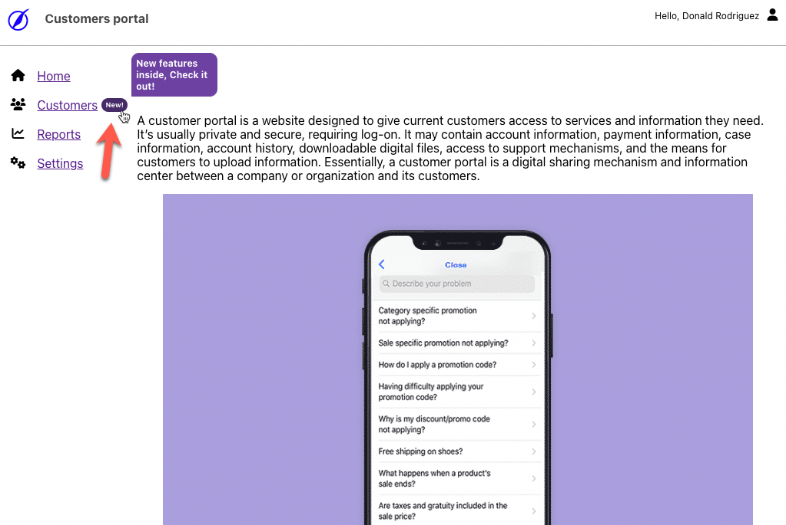

<div style="text-align: center">
    <h1>Thatsnu!</h1>
    <p style="font-weight: bold">Announce your users about features you just launched!</p>
    <p>
        Thatsnu is an agnostic library to have new features indicators next to HTML element across your application and self-explain 
        your users about new feature and data that coming up. 
    </p>
</div>

[](https://www.npmjs.com/package/@thatsnu/browser-sdk)
[](https://www.npmjs.com/package/@thatsnu/browser-sdk)
[](https://github.com/thatsnu/browser-sdk/actions/workflows/ci.yml)
[](https://codecov.io/gh/thatsnu/browser-sdk)

# Motivation

test

## 🤷‍ Problem

<p>
    Are you familiar with those requests by your Product Manager to highlight features you developed as "New" but you 
    said: "Oh, we need to invest a time and build something generic for the whole product and not just for this specific case" and then its postponed?
    <br><br>
    Did they also asked you to have the same ability but for new dynamic data that appear in lists?
    <br><br>
    With Thatsnu you can cover those use-cases easily and save the time of building such a mechanism, save the features
    the user exposed to, so later he won't see them again.
</p>

## 🙋‍ ️Use cases

<ul style="list-style-type: space-counter;">
    <li>Announce new features, step by step</li>
    <li>Introduce recently added dynamic data</li>
    <li>Combine both..</li>
</ul>

## ⭐️ ️Features

<ul style="list-style-type: space-counter;">
    <li>Group features hierarchically, with same look & feel</li>
    <li>Automatically expire an after users should be familiar with it</li>
    <li>Customize each indicator via Javascript code or HTML attributes</li>
    <li>Have bi-directional sync between user's watched indicators for <a href="#persistence">persistence</a> capabilities</li>
</ul>

# Usage

## 📦 Install

```bash
npm install --save-dev @thatsnu/browser-sdk
```

## 🪄 Basic usage

<p id="basicUsage"></p>

1. Define an indicator next to an existing element(s) on your page

```html

<span
    data-tnu-id="customers"
    data-tnu-text"New!"
    data-tnu-tooltip="New features inside, Check it out!"></span>

```

2. Initialize the SDK:

```ts
import thatsnu from '@thatsnu/browser-sdk';

await thatsnu.init({
    defaultColor: '#462a68'
});

```

3. Watch the results:



4. When a user clicks on the New icon, it disappears, and next time he won't see it anymore.

## ⚙️ Options

### SDK options

<p id="sdkOptions"></p>

Here are the options you can provide the SDK init function (`thatsnu.init(...)` <a href="#basicUsage">above</a>):

<table>
    <thead>
        <tr>
            <th>Name</th>
            <th>Type</th>
            <th>Description</th>
            <th>Default value</th>
        </tr>
    </thead>
    <tbody>
        <tr>
            <td style="font-weight: bold" id="defaultColor">defaultColor</td>
            <td>string</td>
            <td>A valid CSS color (hexa, rga, rgba, string) that will apply by default to all the indicators on page</td>
            <td style="background-color: #462a68;color: white;">#462a68</td>
        </tr>
        <tr>
            <td style="font-weight: bold">indicators</td>
            <td>Array&lt;IndicatorOption&gt;</td>
            <td>
                An array of objects that alternatively can describe the indicator's options from the <a href="#indicatorOptions">table below</a> instead of using HTMl attributes. 
                <br>
                When provide this array, you have to provide `id` property for each object and make sure it has a correspondence 
                HTML element with similar `data-thatsnu-id`, the rest of the properties will define the element instead
                of doing it via HTML attributes.
                <br>
                If an HTML attribute will be provided in addition, it has more power than the object property, and it'll override it.
                <br><br>
                The `id` property can be also a wildcard (e.g. `feature.*`) to let you configure multiple and/or dynamic
                Indicators in one object.
            </td>
            <td>&nbsp</td>
        </tr>
        <tr>
            <td style="font-weight: bold">onClick</td>
            <td>Function (id: string) => boolean</td>
            <td>
                A callback function that will invoke when a user clicks one of indicators.<br>
                You'll receive the id (aka: `data-tnu-id`) of the clicked element and then you need to return a boolean value 
                than tells the SDK if this user's click considered - so next time the user won't see this indicator - or not.
            </td>
            <td>&nbsp</td>
        </tr>
        <tr>
            <td style="font-weight: bold">initialState</td>
            <td style="font-weight: bold">Array&lt;string&gt;</td>
            <td>an initial state of identifiers you want to initiate the SDK with.
                <br><br>
                When provide this state to the SDK, it considered as the user already clicked the elements with such ID
                and won't see it again.
                <br><br>
                Required to use if you're managing the <a href="#persistence">persistence layer</a> by yourself.
            </td>
            <td>&nbsp</td>
        </tr>
        <tr>
            <td style="font-weight: bold">getState</td>
            <td>Function () => Array&lt;string&gt;</td>
            <td>
                A method that return all indicators ID's the user clicked so far.
                <br><br>
                Required to use if you're managing the <a href="#persistence">persistence layer</a> by yourself.
            </td>
            <td>&nbsp</td>
        </tr>
        <tr>
            <td style="font-weight: bold">debugTooltip</td>
            <td>boolean</td>
            <td>A boolean that prevent mouse-out event from an indicator to leave the tooltip open and let the developer design it.</td>
            <td>false</td>
        </tr>
        <tr>
            <td style="font-weight: bold">resetState</td>
            <td>Function () => void</td>
            <td>
                Calling this function will reset the state of clicked elements by user.
                <br><br>
                This is useful when you want to start from scratch and delete all stored values in the localStorage
            </td>
            <td>false</td>
        </tr>
        <tr>
            <td style="font-weight: bold">dispose</td>
            <td>Function () => void</td>
            <td>Calling this function will shutdown the library completely include remove stored data and running processed</td>
            <td>false</td>
        </tr>
    </tbody>
</table>

### Indicator options

<p id="indicatorOptions"></p>

Here are the options of a particular indicator's, they can be provided via HTML attributes or inside each object in the `indicators` array that sent to the SDK <a href="#basicUsage">above</a>.

<table>
    <thead>
        <tr>
            <th>JS property</th>
            <th>HTML attribute</th>
            <th>Description</th>
            <th>Mandatory</th>
            <th>Default value</th>
        </tr>
    </thead>
    <tbody>
        <tr>
            <td style="font-weight: bold">id</td>
            <td style="font-weight: bold">data-tnu-id</td>
            <td>
                a unique identifier for an element, the library search and watch on these attributes and generates an indicator next to it<br><br>
                <u>Note:</u> this is the essential part of the library, the bare minimum is to define this as an attribute on an HTML element like in the example <a href="#basicUsage">above</a>, all the rest are optional. 
            </td>
            <td>yes, as an HTMl attribute!</td>
            <td>&nbsp</td>
        </tr>
        <tr>
            <td style="font-weight: bold">text</td>
            <td style="font-weight: bold">data-tnu-text</td>
            <td>the text that will present on the indicator, on this mode the indicator will be squared with the text inside, leave the text empty or omit it, will show a circle indicator</td>
            <td>no</td>
            <td>&nbsp</td>
        </tr>
        <tr>
            <td style="font-weight: bold">className</td>
            <td style="font-weight: bold">data-tnu-class-name</td>
            <td>a class-name that will be added to the indicator to help you to apply your own design</td>
            <td>no</td>
            <td>&nbsp</td>
        </tr>
        <tr>
            <td style="font-weight: bold">styles</td>
            <td style="font-weight: bold">data-tnu-styles</td>
            <td>a JSON string of css rules to override the indicator's styles, all CSS rules are valid here</td>
            <td>no</td>
            <td>&nbsp</td>
        </tr>
        <tr>
            <td style="font-weight: bold">color</td>
            <td style="font-weight: bold">data-tnu-color</td>
            <td>define a color for the indicator, this override the <a href="#defaultColor">defaultColor</a> value on the SDK initiation</td>
            <td>no</td>
            <td>SDK.defaultColor</td>
        </tr>
        <tr>
            <td style="font-weight: bold">expiration</td>
            <td style="font-weight: bold">data-tnu-expiration</td>
            <td>the date that this identifier is not valid anymore, in such a case the library won't generate an indicator next to it, this is useful when u know the due date of the feature promotion in advanced, and you don't want the user to see it after automatically.
                <br><br>
                When an HTML attribute in use, this value must be provided as a valid date's string that <a href="https://developer.mozilla.org/en-US/docs/Web/JavaScript/Reference/Global_Objects/Date/Date">Date</a> constructor knows to parse.
                <br>                
                When a JS property in use, you can provide a regular JS date object.
            </td>
            <td>no</td>
            <td>&nbsp</td>
        </tr>
        <tr>
            <td style="font-weight: bold">tooltipText</td>
            <td style="font-weight: bold">data-tnu-tooltip-text</td>
            <td>a text for the indicator's tooltip</td>
            <td>no</td>
            <td>"New!"</td>
        </tr>
        <tr>
            <td style="font-weight: bold">tooltipClassName</td>
            <td style="font-weight: bold">data-tnu-tooltip-class-name</td>
            <td>a class-name that will be added to the indicator's tooltip for your conform to apply a custom design</td>
            <td>no</td>
            <td>&nbsp</td>
        </tr>
        <tr>
            <td style="font-weight: bold">tooltipStyles</td>
            <td style="font-weight: bold">data-tnu-tooltip-styles</td>
            <td>a JSON string of css rules to override the indicator's tooltip styles that appear on user's mouse hover, all CSS rules are valid here</td>
            <td>no</td>
            <td>&nbsp</td>
        </tr>
    </tbody>
</table>

## 🏆 Example

### General

<u>Worth to invest 5 minutes to read!</u>

The library has two parts, HTML declaration of the elements you want to indicate and a javascript SDK that once initiated, search and generates indicators next to the HTML elements you declared.

Each HTML element has to have an identifier that defines via the `data-tnu-id` attribute, this value should be unique across your system to prevent conflicts with other elements and to be able to understand whether the user already clicked/saw it or not and hide it later.

### New feature introduction

For example, assume you added a new reports system for your users, probably you're going to have a new menu item on the left, that you want the user to be aware of, and stop shows it when use clicked on it or after a while when users got used to it.

To do so, add the following attributes to your exists menu item element belong to the nre Reports:

```html
<div 
    data-tnu-id="reports" 
    data-tnu-tooltip="Introducing new reporting system!" 
    data-tnu-expiration='2022-11-15T23:59:59.728Z'>
  Reports
</div>
```

This code will generate an indicator next to the Reports menu item: 


And it'll be visible until 2022-11-15, end of day, or if the user will click it.

Later, you added few new reports to the list, and you want to make sure the user is aware of them, you can add the following to each:

<div style="font-size: 0.7em">Example in <a href="https://reactjs.org/">React.js</a></div>

```jsx
const ReportsComponent = () => {
    const reports = [{ id: 1, name: 'All customers'}, { id: 2, name: 'Youth customers' }];
    
    return (
        <table>
            <tr>
                <th>ID</th>
                <th>Name</th>
            </tr>
            { reports.map(report => {
                if (report.isNew) {
                    <td
                        data-tnu-id={`reports.${report.id}`}
                        data-tnu-text='New!'
                        data-tnu-tooltip={`New report added: ${report.name}`}>
                        {report.id}
                    </td>
                } else {
                    <td>{report.id}</td>
                }
                <td>{report.name}</td>
            })}
        </table>
    );
}
```

This code will generate an indicator next to each new report:


Later, you added a new feature to let user share a report with others, inside a report page there will be a Share button, and you can use this code to make the users aware of it:

```html
<div>
  <button>
    Share
  </button>
  <span data-tnu-id="reports.share"
        data-tnu-tooltip="New! share this report with others"></span>
</div>
```

The code will generate an indicator next to the share button:


## Persistence

<p id="persistence"></p>

By default, the library persist the user's clicks on indicators on localStorage, its good as long as the user 

This library is front-end only (for now) and to make sure the same user won't see indicators he alreasy say form another \
browser, you need to handle 